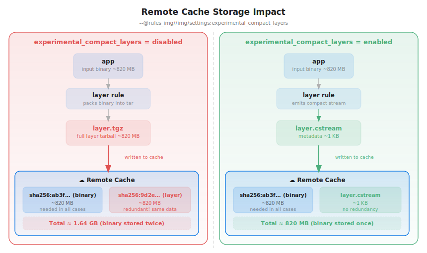

# Compact Stream Representation (v1)

A compact stream is a compact representation of a byte stream (optionally
compressed) where contiguous ranges of the uncompressed data are replaced by
content-addressed storage (CAS) references. The original stream can be
reconstructed bit-for-bit from the compact stream plus the referenced blobs retrieved
from a content-addressed store.

**This document has two parts** — a user-facing guide to turning compact layers on
and using them, and the byte-level specification of the on-disk format:

- **Using compact layers:** [Enabling in a Bazel build](#enabling-in-a-bazel-build) ·
  [What this means in practice](#what-this-means-in-practice) ·
  [Usage (CLI)](#usage) ·
  [Reconstructing a layer](#reconstructing-a-layer-from-a-compact-stream) ·
  [Inspecting a compact stream](#inspecting-a-compact-stream-without-reconstruction) ·
  [FAQ](#faq)
- **On-disk format (specification):** [Overview](#overview) ·
  [File Header](#file-header) ·
  [CAS Reference Table](#cas-reference-table) ·
  [Byte Stream](#byte-stream) ·
  [Reconstruction](#reconstruction)

## Enabling in a Bazel build

This is an experimental, opt-in feature. Enable it by adding the following to
your `.bazelrc` (or passing it on the command line):

```
common --@rules_img//img/settings:experimental_compact_layers=enabled
```

When enabled, layer rules stop producing the layer tar as a file output and emit
this compact stream (plus a content-addressed directory of the layer's input files)
instead, so layer blobs are never written to the Bazel remote cache. The layer
tar is reconstructed on demand at push/load time only when it is actually needed.

## What this means in practice

Container layers are large and, in the Bazel cache, largely redundant. A layer is
just a tar of files that Bazel already has — the build inputs and outputs that
went into it are stored in the cache (and the remote CAS) as their own blobs.
Packing those same bytes into a layer tarball and caching *that* too stores the
content a second time.

With compact layers enabled, the layer rule emits a tiny `.cstream` file instead
of the full layer tarball. The compact stream keeps the layer's tar scaffolding
(headers and padding) inline and replaces the bulk file content with CAS
references to the blobs the cache already holds. The real layer tar is rebuilt on
demand at push/load time. Net effect: the large content is stored **once** (as its
own blob) instead of **twice** (blob + layer tarball).



The diagram contrasts the two modes for an image whose layer is an ~820 MB binary:

- **Disabled (left):** the layer rule writes a full ~820 MB `layer.tgz` to the
  remote cache. The cache ends up holding the binary blob *and* a layer tarball
  made of the same bytes — roughly **1.64 GB**, with the payload duplicated.
- **Enabled (right):** the layer rule writes a ~1 KB `layer.cstream` that
  references the binary blob instead of copying it. The binary is the only large
  object in the cache — roughly **820 MB**, stored once with no redundancy.

### A real example

The [`e2e/go/compact_layers`](../e2e/go/compact_layers) target builds a Go binary
with ~820 MiB of embedded data and packages it into an image. Building the layer
with the flag enabled produces a `.cstream` where the layer tarball would
normally be:

```console
$ bazel build --@rules_img//img/settings:experimental_compact_layers=enabled \
    //compact_layers:image.layer
Target //compact_layers:image.layer up-to-date:
  bazel-bin/compact_layers/image.layer.tgz.cstream
```

Inspecting that output shows an 828 MiB layer described by a 287-byte file:

```console
$ img compact-stream ls bazel-bin/compact_layers/image.layer.tgz.cstream
compact stream: bazel-bin/compact_layers/image.layer.tgz.cstream

Header
  Format:                            compact stream, version 1
  Hash algorithm:                    sha256 (32-byte digests)
  Stream compression:                zstd
  Layer compression:                 gzip (level 1, jobs 16)
  Seekable (estargz):                no
  End padding:                       0 bytes
  Reference table:                   1 entries at offset 128 (48 bytes)
  Byte stream:                       111 bytes on disk, at offset 176
  Compressed stream digest:          sha256:c84aee00403ed4d1a89a5413f510a3f1fca4227cfe52bbe4f4fb5f57fee5792f

Contents
  512 bytes of stream data
  cas reference sha256:cfb442f65715e69782322d995cb383718f660f9f6117f79ffb6e165aed3a046a 868343266 bytes
  30 bytes of stream data

Statistics
  CAS references:                    1
  Referenced content (in CAS):       868343266 bytes (828.1 MiB)
  Byte stream (uncompressed):        542 bytes
  Byte stream (on disk, zstd):       111 bytes
  Reconstructed tar (uncompressed):  868343808 bytes (828.1 MiB)
  Reconstructed layer (gzip):        867505231 bytes (827.3 MiB)
  Compact stream file size:          287 bytes

Efficiency
  Compact stream vs reconstructed tar (uncompressed): 0.00% (3025588.2x smaller)
  Compact stream vs reconstructed layer (compressed): 0.00% (3022666.3x smaller)
```

The 828 MiB of file content never enters the `.cstream`: it is the single
`868343266`-byte **CAS reference** under *Contents*, resolved from the
content-addressed store when the layer is reconstructed. Only the tar scaffolding
around it travels in the compact stream — 542 bytes of headers and padding, 111
bytes once zstd-compressed. Together with the 128-byte header and the 48-byte
reference table, the entire 828 MiB layer is represented by **287 bytes on disk**,
roughly three-million times smaller than the layer it stands in for.

## Overview

A compact stream file consists of three parts:

1. A **128-byte uncompressed file header** containing format metadata, hash
   algorithm, compression settings, offset/size pointers to the data sections,
   and an optional digest and size of the reconstructed compressed stream.
2. A **CAS reference table** (uncompressed) listing the offsets, digests,
   and sizes of data replaced by CAS references.
3. A **byte stream** (optionally zstd-compressed) containing the remaining
   bytes of the original stream with the CAS-referenced ranges removed.

```
+-------------------------------------------+
|  File Header (128 bytes, uncompressed)    |
+-------------------------------------------+
|  CAS Reference Table (uncompressed)       |
+-------------------------------------------+
|  Byte Stream (optionally zstd-compressed) |
+-------------------------------------------+
```

## File Header

The file header is always uncompressed so that readers can identify the format
and determine how to locate and decompress the data sections.

```
Offset  Size  Type       Field                  Description
------  ----  ---------  ---------------------  -------------------------------------------
0       6     ASCII      Magic                  "CASSTR"
6       1     uint8      NUL                    Always 0x00
7       1     uint8      Version                Format version (0x01)
8       2     uint16 BE  HashAlgorithm          Digest algorithm for content hashes
10      2     uint16 BE  HashSize               Digest size in bytes
12      1     uint8      StreamCompression      On-disk compression of the byte stream section
13      1     uint8      OriginalCompression    Compression of the original file
14      1     uint8      SeekableCompression    Whether seekable compression was used (0/1)
15      1     int8       CompressionLevel       Original compression level (-1 = default)
16      1     uint8      CompressorJobs         Number of parallel compression workers (0 = default)
17      3     -          Reserved1              Must be zero
20      4     uint32 BE  EndPadding             Trailing zero bytes in the original stream
24      8     uint64 BE  RefTableOffset         Byte offset from file start to CAS ref table
32      8     uint64 BE  RefTableSize           Size in bytes of the CAS reference table
40      8     uint64 BE  StreamOffset           Byte offset from file start to byte stream
48      8     uint64 BE  StreamSize             Size in bytes of the byte stream (on disk)
56      1     uint8      Flags                  Bit flags (see below)
57      7     -          Reserved2              Must be zero
64      8     uint64 BE  CompressedStreamSize   Size of the reconstructed compressed stream (optional)
72      56    bytes      CompressedStreamDigest Digest of the reconstructed compressed stream (optional)
```

Total: 128 bytes.

### Flag values

| Bit  | Mask | Meaning                                                              |
|------|------|---------------------------------------------------------------------|
| 0    | 0x01 | Compressed-stream info present (CompressedStreamSize/Digest valid)   |

When bit 0 is clear, the `CompressedStreamSize` and `CompressedStreamDigest`
fields are absent (zero) and must be ignored.

### Hash algorithm values

| Value | Algorithm |
|-------|-----------|
| 1     | SHA-256   |

### Stream compression values

| Value | Compression |
|-------|-------------|
| 0     | None        |
| 1     | zstd        |

### Original compression values

| Value | Compression |
|-------|-------------|
| 0     | None        |
| 1     | gzip        |
| 2     | zstd        |

### Compression metadata

The file header records two distinct compression concepts:

- **StreamCompression**: How the byte stream section is compressed on disk
  within this compact stream file (for storage efficiency). Readers decompress this
  section before using its contents.

- **OriginalCompression**: What compression the original file uses. After
  reconstruction (merging stream bytes with CAS blobs), the result is the
  uncompressed original. To obtain the original compressed form, re-compress
  using `OriginalCompression`, `SeekableCompression`, `CompressionLevel`,
  and `CompressorJobs`.

- **SeekableCompression**: `1` if seekable compression was applied (e.g.
  estargz for container image layers), `0` otherwise.

- **CompressionLevel**: The compression level as a signed byte. `-1` means
  the library default. For gzip: 0-9. For zstd: values fit within int8 range.

- **CompressorJobs**: Number of parallel compression workers. `0` means
  default. `1` means single-threaded. Values > 1 indicate parallel compression.

- **EndPadding**: Number of trailing zero bytes appended after the original
  stream content. For tar files, standard archives end with two 512-byte zero
  blocks (1024 bytes), but the rules_img tooling does not add end-of-archive
  padding, so this value is typically `0`.

### Compressed stream digest and size (optional)

When the compact stream is produced in a single pass (as the layer tool does), the
digest and size of the reconstructed *compressed* stream — i.e. the original
compressed file the compact stream represents — are known for free because the
compressor already computes them. These are recorded in the optional
`CompressedStreamDigest` and `CompressedStreamSize` header fields, gated by
flag bit 0.

This information is hard to obtain when a compact stream is assembled incrementally
across multiple passes (by appending), so the fields are optional: a writer
that does not know them leaves flag bit 0 clear.

`CompressedStreamDigest` uses the same hash algorithm as the rest of the compact stream
(`HashAlgorithm`) and occupies `HashSize` bytes of the fixed 56-byte slot at
offset 72; the remaining bytes are zero.

When present, these fields are validated during reconstruction: after the
compressed stream is rebuilt, its digest and size must match the recorded
values, otherwise reconstruction fails. This guards against a corrupt compact stream,
mismatched CAS blobs, or a compressor that does not reproduce the original
bytes.

> **Compressor version compatibility.** Reconstruction reproduces the original
> compressed layer by *re-compressing* the rebuilt tar with the recorded
> settings (`OriginalCompression`, `CompressionLevel`, `CompressorJobs`,
> `SeekableCompression`). Bit-for-bit equality therefore depends on the
> compression libraries producing identical bytes. The contract is implicitly
> pinned to the compression-library versions of the `img` binary that *wrote*
> the compact stream (the bundled gzip/pgzip, zstd, and estargz
> implementations). A compact stream written by one `img` version and
> reconstructed by another whose compressors emit different bytes will fail the
> compressed-stream digest check above rather than silently producing a
> different layer. Compact streams are intended as intermediate build artifacts
> consumed by the same toolchain, not as long-lived archives that survive
> toolchain upgrades.


## CAS Reference Table

The reference table is a flat array of fixed-size entries, sorted by `Offset`
ascending. Each entry describes one contiguous range in the uncompressed
original stream that has been replaced by a CAS reference:

```
Offset  Size      Type       Field    Description
------  --------  ---------  -------  -------------------------------------------
0       8         uint64 BE  Offset   Byte offset in the reconstructed uncompressed stream
8       HashSize  bytes      Digest   Content digest of the replaced data
8+HS    8         uint64 BE  Size     Number of bytes replaced by this CAS reference
```

Entry size = `16 + HashSize` bytes (48 bytes for SHA-256).

The number of entries is `RefTableSize / (16 + HashSize)`.

Key properties:
- Entries are sorted by `Offset` ascending.
- Entries must not overlap: for any two adjacent entries `i` and `i+1`,
  `entries[i].Offset + entries[i].Size <= entries[i+1].Offset`.
- Fixed-size entries enable O(1) random access by index.

## Byte Stream

The byte stream contains the bytes of the original uncompressed file with
the CAS-referenced ranges removed. Specifically, if the original uncompressed
file is `F` of some length, and there are CAS references at offsets
`[o_0, o_1, ..., o_{n-1}]` with sizes `[s_0, s_1, ..., s_{n-1}]`, then
the stream is the concatenation of:

```
F[0 : o_0] || F[o_0+s_0 : o_1] || F[o_1+s_1 : o_2] || ... || F[o_{n-1}+s_{n-1} : len(F)]
```

If `StreamCompression` is non-zero, the stream section is compressed with the
specified algorithm. `StreamSize` is the on-disk (compressed) size.

## Reconstruction

To reconstruct the original uncompressed file from a compact stream:

1. Read the 128-byte file header. Validate the magic and version. Extract
   the hash size, stream compression, and section offsets/sizes.
2. Read the CAS reference table (`RefTableSize` bytes at `RefTableOffset`).
   Parse into a sorted list of `(Offset, Digest, Size)` entries.
3. Open the byte stream at `StreamOffset`. If `StreamCompression` is non-zero,
   create a decompressor.
4. Initialize `output_pos = 0`, `ref_idx = 0`.
5. Loop while `ref_idx < ref_count`:
   a. `gap = refs[ref_idx].Offset - output_pos`
   b. Copy `gap` bytes from the stream to the output.
   c. Fetch the blob from the CAS using `refs[ref_idx].Digest`.
   d. Write the blob bytes to the output.
   e. `output_pos = refs[ref_idx].Offset + refs[ref_idx].Size`
   f. `ref_idx++`
6. Copy all remaining bytes from the stream to the output.

The result is the original uncompressed file. To obtain the original
compressed form:

7. If `OriginalCompression != 0`, re-compress the output using the settings
   from the header (`OriginalCompression`, `SeekableCompression`,
   `CompressionLevel`, `CompressorJobs`).
8. Append `EndPadding` zero bytes.

9. If flag bit 0 is set, verify the reconstructed compressed stream: its digest
   and byte count must equal `CompressedStreamDigest` and `CompressedStreamSize`.
   Reconstruction fails on any mismatch.

## Usage

The layer command produces a compact stream when the `--compact-stream` flag is set:

```bash
img layer \
  --add /app/bin/server=./server \
  --compact-stream layer.cstream \
  layer.tgz
```

To inline small files (e.g. below 4096 bytes) directly in the stream
instead of emitting CAS references:

```bash
img layer \
  --add /app/bin/server=./server \
  --compact-stream layer.cstream \
  --compact-stream-inline-threshold 4096 \
  layer.tgz
```

When `--compact-stream-inline-threshold` is set, files smaller than the threshold
have their content stored directly in the byte stream (no CAS reference is
emitted). This eliminates CAS lookups during reconstruction for small files.

The byte stream is zstd-compressed by default. The original compression
metadata is automatically derived from the layer's compression settings.

## Reconstructing a layer from a compact stream

CAS references are addressed by the sha256 of their content, so reconstruction
only needs a content-addressed store of the referenced blobs. The `cas-dir`
command builds such a store (a directory laid out as `sha256/<hex>`) from the
files that went into the layer:

```bash
img cas-dir --output ./layer-cas --from-file inputs.txt
```

`compact-stream reconstruct` then rebuilds the original tar bit-for-bit from the compact stream
and that directory, writing to a file or to stdout (`-`):

```bash
img compact-stream reconstruct \
  --compact-stream layer.cstream \
  --cas-dir ./layer-cas \
  --output layer.tgz
```

## Inspecting a compact stream without reconstruction

`compact-stream list` (alias `ls`) prints a human-readable view of a compact stream — its
header, its contents in reconstruction order (interleaved inline stream segments
and CAS references), and summary statistics — without rebuilding the tar:

```bash
img compact-stream list layer.cstream
```

The statistics include the number of CAS references, the bytes held in the CAS,
the byte stream's compressed (on-disk) and uncompressed sizes, the size of the
reconstructed (uncompressed) tar, the compact stream file size, and the resulting
efficiency (how much smaller the compact stream is than the tar it represents).

When the compact stream records the compressed-stream digest and size (the layer tool
always does), `list` also reports the compressed layer size and its efficiency
directly from the header — no CAS blobs are fetched and no reconstruction is
performed:

```bash
img compact-stream list layer.cstream
```

If those fields are absent, the compressed layer size is reported as unknown.

## FAQ

**Does this mean I can have my cake and eat it too?**

Yes.

**Why does this problem exist in the first place?**

The [OCI image spec](https://github.com/opencontainers/image-spec) defines a layer
as a tar archive (optionally compressed). A tar concatenates every file's content
into one opaque blob, so a content-addressed cache can only deduplicate whole
layers — two layers that share a single file still store that file's bytes twice. A
more efficient representation would be a Merkle tree in which each file is its own
content-addressed blob and a layer is just a list of references to them. That is
exactly how Bazel's [Remote Execution API](https://github.com/bazelbuild/remote-apis)
models directories: a `Directory` message references its files by digest, so
identical files are stored once and shared everywhere. A compact stream is
essentially that file-level representation, wrapped so it can be turned back into
the opaque tar the OCI spec demands.

**Why does the layer action still exist?**

It does the work that can only be done once, up front: it computes the compact
stream representation *and* the digests of both the uncompressed and the compressed
layer blob. OCI images are strongly content-addressed, so those digests are needed
before anything is assembled or pushed — the image **config** JSON records the
**uncompressed** layer digest (its `diff_id`), and the image **manifest** JSON
records the **compressed** layer digest and size. The layer action produces all of
that metadata without keeping the (large) layer blob as an output.

**Aren't we doing extra work by reconstructing the layer whenever it is requested?**

Yes. Previously the compression/digesting pipeline ran once per layer — in the
layer action — and the resulting blob was cached. Now it runs once in the layer
action (to obtain the digests above), the bytes are thrown away, and the work is
redone whenever the bytes are actually needed. In practice we expect that to happen
exactly once: when the layer is pushed or loaded. And the recomputation is cheap:
streaming a layer is an I/O-bound task, and modern CPUs reconstruct and (re)compress
a data stream far faster than it can be uploaded to a registry or written to disk,
so the extra CPU work is essentially hidden behind the transfer it accompanies.

**What if a layer consists of many small files?**

Every file stored as a CAS reference has to be fetched from the content-addressed
store to be materialized during reconstruction. A layer made of many small files
therefore incurs many round trips, and that latency — not CPU — can dominate
reconstruction. For this case there is a dial to **inline** small files directly
into the compact stream's byte stream instead of referencing them: the
`--compact-stream-inline-threshold` flag (and the
`experimental_compact_layers_inline_threshold` build setting), described under
[Usage](#usage). Files below the threshold travel inside the compact stream itself,
so they need no CAS lookup at reconstruction time.

